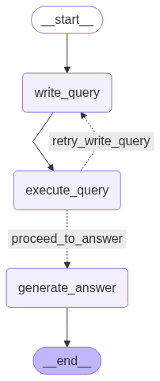

# text2sql Wizard 🧙‍♂️

A conversational AI assistant that translates natural language questions into SQL queries, executes them on a local SQLite database, and returns user-friendly answers. Supports both a Streamlit web UI and a command-line interface (CLI).

---

## Features
- **Natural Language to SQL**: Converts user questions into SQL queries using LLMs (Google Gemini).
- **Conversational Memory**: Maintains chat history for context-aware follow-up questions.
- **Streamlit Web UI**: Interactive chat interface for data exploration.
- **CLI Mode**: Terminal-based chat for quick access.
- **Customizable Database**: A sample SQLite database and setup script.

---

## Project Structure
```
text2sql/
├── main.py                  # Project launcher and management CLI
├── pyproject.toml           # Python project metadata & dependencies
├── README.md                # Project documentation
├── .env                     # Environment variables (API keys, model)
├── data/
│   └── data_query_assistant.db   # SQLite database
├── src/
│   ├── app.py               # Streamlit UI app
│   ├── main_cli.py          # CLI chat interface
│   ├── core/
│   │   ├── config.py        # Config (e.g., top_k)
│   │   ├── database.py      # DB connection logic
│   │   ├── graph.py         # LangGraph pipeline
│   │   ├── graph_components.py # Graph nodes (query, execute, answer)
│   │   ├── llm.py           # LLM initialization
│   │   └── prompts.py       # Prompt templates
│   ├── scripts/
│   │   └── setup_database.py    # DB creation & population
│   └── ui/
│       └── __init__.py
└── tests/
        ├── sample_questions.txt
        └── test_app_logic.py
```

---

## Installation

### 1. Prerequisites
- **Python 3.12+** (required)
- **pip** (Python package manager)
- **Google Gemini API key** (for LLM)

### 2. Clone the Repository
```cmd
git clone https://github.com/Suyash-Bhutara/text2sql.git
cd text2sql
```

### 3. Set Up a Virtual Environment (Recommended)

**Windows (cmd.exe)**:
```cmd
python -m venv .venv
.venv\Scripts\activate
```

**Linux/macOS**:
```bash
python -m venv .venv
source .venv/bin/activate
```

### 4. Install Dependencies
**Windows**:
```cmd
pip install -U pip
pip install -r requirements.txt
# OR, if using pyproject.toml/uv:
pip install uv
uv pip install
```

**Linux/macOS**:
```bash
pip install -U pip
pip install -r requirements.txt
# OR, if using pyproject.toml/uv:
pip install uv
uv pip install
```

### 5. Configure Environment Variables
Create a `.env` file in the project root:
```
GOOGLE_API_KEY=your_google_gemini_api_key
GOOGLE_MODEL=gemini-2.5-flash-preview-05-20
```

- You can find your API key at https://aistudio.google.com/app/apikey
- The model name can be changed to any supported Gemini model.

---

## Project Management & Usage

All main actions are managed via `main.py` using command-line arguments:

### 1. Set Up the Database
If `data/data_query_assistant.db` does not exist, create and populate it:

**Windows**:
```cmd
python main.py setup_db
```

**Linux/macOS**:
```bash
python3 main.py setup_db
```
This will generate a sample database with synthetic data for testing.

### 2. Launch the Streamlit Web App
Start the chat UI in your browser:

**Windows**:
```cmd
python main.py run_app
```

**Linux/macOS**:
```bash
python3 main.py run_app
```
- Interact with the assistant in a chat format.
- View generated SQL queries and results.

### 3. Launch the Command-Line Interface (CLI)
Start a terminal chat session:

**Windows**:
```cmd
python main.py run_cli
```

**Linux/macOS**:
```bash
python3 main.py run_cli
```
- Type your questions and get answers directly in the terminal.
- Type `exit` or `quit` to end the session.

#### Available Actions
- `run_app`   : Launches the Streamlit web UI
- `setup_db`  : Initializes or resets the database
- `run_cli`   : Starts the command-line chat interface

---

## How It Works

1. **User Input**: User asks a question (UI or CLI).
2. **LangGraph Pipeline**:
   - `write_query`: LLM generates SQL query from question & chat history.
   - `execute_query`: Runs SQL on the SQLite DB.
   - `generate_answer`: LLM explains the result in natural language.




3. **Conversational Memory**: Maintains context for follow-up questions.
4. **Error Handling**: If clarification or errors occur, the assistant asks for more info or explains the issue.

---

## Configuration
- **Top K Results**: Set in `src/core/config.py` (`DEFAULT_TOP_K_RESULTS`).
- **Database Path**: Controlled in `src/core/database.py`.
- **Prompts**: Customizable in `src/core/prompts.py`.

---

## Extending & Customization
- Add new prompt templates or LLM providers in `src/core/`.
- Modify the database schema and update the setup script as needed.
- Add new UI features in `src/app.py` (Streamlit) or CLI logic in `src/main_cli.py`.
- Integrate with other databases by updating `database.py`.

---

## Troubleshooting & FAQ

**Q: I get a FileNotFoundError for the database?**
- Run `python main.py setup_db` to create the database.

**Q: LLM errors about missing API key?**
- Ensure `.env` is present and contains a valid `GOOGLE_API_KEY`.

**Q: How do I change the LLM model?**
- Edit `GOOGLE_MODEL` in your `.env` file.

**Q: Can I use my own data?**
- Modify `setup_database.py` to create tables and populate with your data.

**Q: How do I add more tables or columns?**
- Update the schema in `setup_database.py` and regenerate the database.

---

## Credits
- Built with [LangChain](https://python.langchain.com/), [Streamlit](https://streamlit.io/), and [Google Gemini](https://aistudio.google.com/).

---

For questions or contributions, open an issue or pull request!
